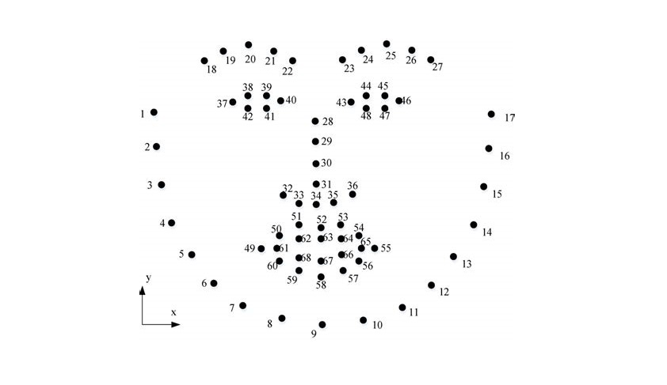

# FLAT-O
Facial Landmark Annotation Tool with OpenCV

## Features

- Simple OpenCV GUI for 68-keypoint facial landmark annotation.
- Annotate more than one face per image.
- For each feature (nose, eyes, eyebrows...) mark as many points as you like and the final **keypoints will be calculated automatically so that they are distributed evenly**. This means that you are not limited to a certain number of points per feature. You use as many as you need and the program will extract the correct number of keypoints for that feature.
  - I have implemented two modes:
    1. Fit a curve to your selected points and then pick _N_ points from that curve (according to the number of points of the current face part)
    2. Pick _N_ equidistant points along the path defined by the points you selected.
- Export the annotations in a single XML file, following the [Dlib's example XML file](https://github.com/davisking/dlib/blob/master/examples/faces/training_with_face_landmarks.xml).

### 68 facial landmark annotation

Here is the template for annotating 68 keypoints of a face:

### How to annotate eyes and lips

Eyes and lips are the only features that are closed shapes, and that would break the method I'm using for automatically spacing the keypoints. For that reason, I have separated the annotation of eyes and lips in many parts:

- Eyes (left and right)
  - Upper eyelid: 37 to 40 and 43 to 46
  - Lower eyelid: [40, 41, 42, 37] and [46, 47, 48, 43]
- Mouth
  - Outer
    - Upper lip: 49 to 55
    - Lower lip: [55, 56, 57, 58, 59, 60, 49]
  - Inner
    - Upper lip: 61 to 65
    - Lower lip: [65, 66, 67, 68, 61]

This means that, in order to annotate the lower eyelids and lips properly, you will have to mark the edge points [37, 40, 43, 46, 49, 55, 61, 65] twice. This is an example: let's suppose you are annotating the left eye:

1. First, you mark the keypoints for the upper eyelid: 37, 38, 39 and 40.
2. Press <space> and the final keypoints will be generated.
3. Move onto the next feature (lower eyelid) and mark the keypoints 40, 41, 42 and 37. However, the keypoints 37 and 40 won't be overwritten because they were already saved in the previous part.
